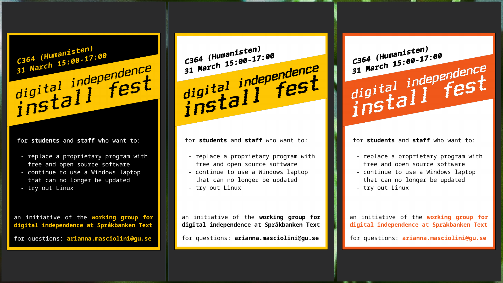
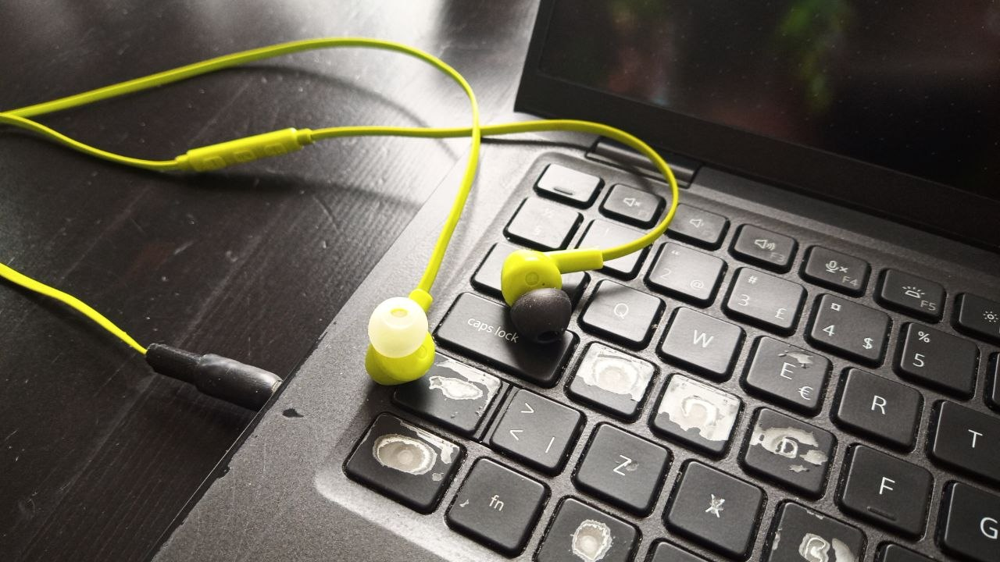

After enjoying every day of my [adventyr](2025.md) (_advent_ + _äventyr_ 'adventure') in December I was so ready for a short vårvinterventure ([_vårvinter_](https://watchingtheswedes.com/2010/03/17/the-longest-swedish-word/#:~:text=Literally%20translated%2C%20it%20means%20%E2%80%98winterspring%E2%80%99%20or%20%E2%80%98springwinter%E2%80%99.%20It%20is%20used%20to%20describe%20this%20time%20of%20the%20year%2C%20when%20winter%20slowly%20but%20surely%20crawls%20exhausted%20over%20into%20spring.%20It%E2%80%99s%20a%20word%20that%20boulsters%20the%20self-confidence%20of%20Swedes%20because%20it%20means%20that%20spring%20is%20on%20the%20way.%20It%20also%20acts%20as%20a%20way%20for%20Swedes%20to%20deceive%20themselves%20that%20spring%20is%20already%20here%20even%20though%20it%20still%20might%20be%20snowing.) + adventure)!
This is a [week-long event](https://eli.li/december-adventure-march-2026) and it comes after a couple months where I've been writing a lot, so I'm burning to do something more technical.
Problem is, I realize I am quite exhausted and this should rather be a week of self-expectation minimization.
If I manage anything, however small, beyond the ominous must-do list, I'll take note of that in this log. 

#### Monday[^1]
- created [a Codeberg account](https://codeberg.org/harisont). The plan is not to quit GitHub (quite yet), but to gradually move at least my personal projects somewhere better
- sketched a flyer to promote one of my upcoming subversive events while on a call with a distant friend

#### Tuesday
- finished the flyer, even made different versions for digital and print. Definitely not a masterpiece of design, but hopefully it'll do the job. As long as we get it to print correctly...

    

#### Wednesday
- went around my faculty's building leaving flyers here and there
- got the sudden urge to do something with my hands and merged a pair of wired earbuds with a broken jack and a malfunctioning aux cable into a pair of working earbuds! (exclamation mark due because it was my first time using soldering iron unsupervised and my second time ever) 
  
  

#### Thursday
stressed, tired -- nada.

#### Friday
- finally fixed audio on my work laptop (it wasn't even hard) and copied some of the music I usually listen to while I write (text or code) to an SD card that permanently lives in there 

---

[^1]: weeks start on Monday in my world