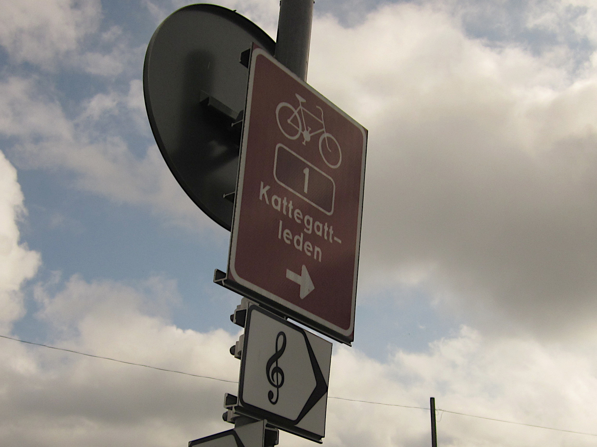

<iframe width="100%" height="500px" frameborder="0" allowfullscreen allow="geolocation" src="//umap.openstreetmap.fr/en/map/kattegattleden_1155729?scaleControl=false&miniMap=false&scrollWheelZoom=false&zoomControl=true&editMode=disabled&moreControl=true&searchControl=null&tilelayersControl=null&embedControl=null&datalayersControl=true&onLoadPanel=none&captionBar=false&captionMenus=true"></iframe>
<a href="//umap.openstreetmap.fr/en/map/kattegattleden_1155729?scaleControl=false&miniMap=false&scrollWheelZoom=true&zoomControl=true&editMode=disabled&moreControl=true&searchControl=null&tilelayersControl=null&embedControl=null&datalayersControl=true&onLoadPanel=none&captionBar=false&captionMenus=true">See full screen</a>

| datum | sträcka | cykelvänlighet |
| --- | --- | --- |
| 18-27 juli 2024 (10 dagar) | över 400 km | kunde inte vara bättre |

Det var flera år sedan som jag började fundera på att cykla genom hela Kattegattleden.
Äntligen gjorde C. och jag det, från Göteborg ner till Helsinborg!

Pa kartan kan man se det officiella GPX-spåret som finns att laddas ner från [kattegattleden.se](https://kattegattleden.se/) (det gula), plus en kortare sträcka som vi lade till den sista dagen (blå).
De röda prickarna markerar start- och slutpunkten för vår resa samt de olika platser där vi övernattade i tält eller, vid ett par tillfällen, på vandrarhem, medan de gula visar alla andra minnesvärda kortare stopp på vägen.

## Dag 1: Göteborg till Rörvik
Den första dagen packade vi våra cyklar och åkte söderut på en för mig mycket bekant cykelbana, åtminstone fram till Särö. 
Just på Särö pausade vi för att äta någonting, men stannade inte länge: på väg dit hade vi redan tagit en stund för att en gång till kolla på Manambo Islas metallskulpturer, mellan Hovås och Billdal.



Vi övernattade i Rörvik, där det finns en trevlig och, om jag nu minns rätt, ganska billig (dvs. billigare än de flesta andra) camping.

## Dag 2: Rörvik till Åsa, med en omväg till Tjolöholms slott
Höjdpunkten för dag två var inte vår lunchpaus i Kungsbacka (där vi åt en överprisad måltid och den första mjukglass på vår resa... och kanske spelade det första, men definitivt inte det sista eller det mest episka MTG-spel), utan att vi tog en omväg till Tjolöholms slott, en 1800-tals byggnad som jag hade besökt år 2018.
Då var jag där med andra nya internationella GU-studenter och det var en julmarknad på gång, men framförallt fick vi komma in i slottet och besöka interiören.
Denna gång kom vi för sent för att komma in, men det måste sägas att trädgården ser betydligt mycket bättre ut under de varma månaderna.



På kvällen tältade vi igen på en camping vid stranden.



## Dag 3: Åsa till Getterön, fågelstället
Vår enda paus på väg från Åsa till Getterön var i den helt ominnesvärda byn som kallas för Bua.
Det var dock just där att våra MTG-spel började att gå överstyr och pågå i all evighet, som man kan tydligt se i bilden nedan. 



Vår slutdestination för dagen var Getterön, en ö som är mest känd bland fågelentusiasterna och som jag sedan dess besökt en gång till med min kompis och kollega M., som gillar fågelskådning.
För första gången under den här resan bestämde vi oss för att njuta av allemansrätten och tälta i naturen.
Vi satte upp tältet mycket nära havet och det var riktigt fuktigt.



## Dag 4: Getterön till Ugglarp, via Falkenberg
Den fjärde dagen var den längsta när det gäller antalet kilometer vi cyklade (egentligen många fler än man ser på kartan, eftersom vi åkte fel).
Vi visste att vädret skulle bli sämre dagen efter och försökte därför gå vidare så mycket som möjligt.
På väg stannade vi i Morup, som jag har inget minne av, och i Falkenberg, som verkar vara en ganska trevlig stad, åtminstone på sommaren.
Stranderna runt där är helt fantastiska.



Som C. och jag ofta gör försökte vi att bara följa skyltarna utan att kolla på kartan på mobilen hela tiden, vilket är helt rimligt i Västra Sverige och ännu mer så när det gäller själva Kattegattleden.
Men vi råkade missa en skylt och fortsätta ganska länge i den fina sommarkvällen innan vi insåg att vi hade åkt fel och det var dags att hitta campingen vi hade förbokat en tältplats på.
Lyckligtvis - speciellt med tanken på priset! - hann vi dit innan receptionen stängdes.
Campingen var extremt väl positionerad, ren och fin.



## Dag 5: Ugglarp till Halmstad
På vägen till Halmstad ösregnade det oavbrutet.
Vi åkte så snabbt som möjligt med bara en kort paus för ett litet mellanmål.
När vi kom till Halmstad, där vi hade bokat ett rum på ett vandrarhem (STF Vandrarhem Halmstad/Kaptenshamn, högt rekommenderat!) var alla våra kläder blöta trots mer eller mindre vattentäta väskor.
Efter en varm dusch gick vi en kort promenad runt staden, men snart började regnet igen. 
Mestadels stannade vi inomhus och vilade.

## Dag 6: Halmstad till Mellbystrand och en besvikande liten stad
Den sjätte dagen var vädret fortfarande långt ifrån optimalt, men i alla fall bättre än prognosen, som hade fått oss att boka ett rum igen, denna gång i Mellbystrand.
Den första pausen var i närheten av en liten kyrka (kanske i Trönninge), där vi träffade en kvinna som solocyklade från Köpenhamn till Oslo (!).

Sedan såg vi en helt tom strand och bestämde stanna där i ett tag och bland annat bada trots den mörka himlen.



Vandrarhemmet i Mellbystrand var enligt C. inte lika bra som det i Halmstad, men jag tyckte att köket var härligt. 
Där lagade för en gångs skull mat på riktigt.



Det är inte alls av en slump att jag nästan glömde nämna Laholm, Hallands äldsta stad, som vi besökte efter att vi lämnade våra grejer på vandrarhemmet. 
Baserad på min guidebok verkade staden ganska inbjudande och konstrik, med dess prisbelönta park och en skulptur "i nästan varje gathörn".
Kanske på grund av de hotfulla molnen som pressade sig på oss tyckte vi att det var snarare Hallands mest överskattade staden.

## Dag 7: Båstad - äntligen i Skåne
Efter sju dagar cykling kom vi till Skåne och mer specifikt till Båstad, en ganska chic badort, rikare på statyer - inte alla lika vackra - än själva Laholm.





Vi övernattade återigen på en camping, den andra av två som tillhör campingkedjan First Camp. 
Varken jag eller min reskamrat är särskilt entusiastiska på dem. 
De lyckas på något sätt vara "för lyxiga" (och därför också dyra!) och värst av allt är att de har musik på toaletterna. 
Usch!

## Dag 8: Vejbystrand


Efter sju dagar cykling bestämde vi ta det lugnt för att min kompis inte mådde så bra. 
Vi fortsatte bara till Vejbystrand där vi hittade ett helt fantastiskt tältställe i naturen direkt vid en havsnära sträcka av Skåneleden, vars exakta koordinater finns på kartan där uppe. 
Tidigt på morgonen väcktes vi upp av några kor som verkade vara nyfikna på vårt tält.

Själva [Skåneleden](https://skaneleden.se/) ser ganska lovande ut och det går att övernatta var som helst, men det är en vandringsled snarare än en cykelled.
Det skulle vara bra att åka tillbaka med någon vandringsugen kompis, kanske min granne E. 

## Dag 9: Vejbystrand till Höganäs, via Ängelholm (näst sista etappen!)
Den näst sista dagen åkte fi först ner till Ängelholm, där vi åt särskilt goda falafel.
Men vi stannade inte länge utan fortsatte genom det Skånska landsbygden.



Efter Arild såg vi för första gången Danmark.



## Dag 10: Helsingborg + bonusetapp i Hyllinge


Och sedan kom det den sista dagen. 
Nu var det soligt igen och det var dags att åka till Helsingborg.
Så snart man kan se staden i fjärran börjar det en nedräkning på cykelbanan som säger hur många kilometer är kvar.





Helsingborg är en stad som jag gärna skulle vilja återvända till för att turista lite, då vi bestämde att cykla vidare till C:s hemstad, Hyllinge, istället för att göra det.
Det finns tyvärr ingen cykelbana eller järnväg som leder till Hyllinge, men att cykla dit var helt rimligt ändå. 
Det kändes faktiskt speciellt bra att göra det efter att vi lämnade alla vara tunga grejer på tågstationens bagagerum.
Hyllinge är en ganska liten tätort, men C. visade mig huset där hon växte upp och sin grundskola.  

När vi kom tillbaka därifrån var det redan kväll och dags att ta tåget tillbaka.
Resan var över, men vi såg redan fram emot nästa äventyr.


