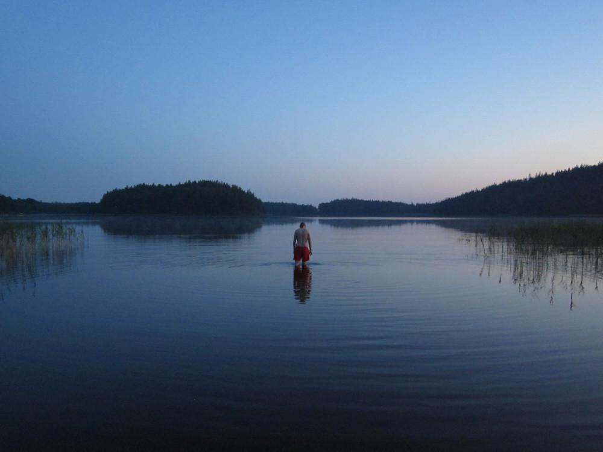
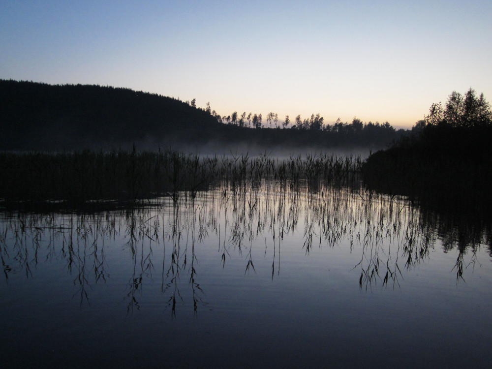
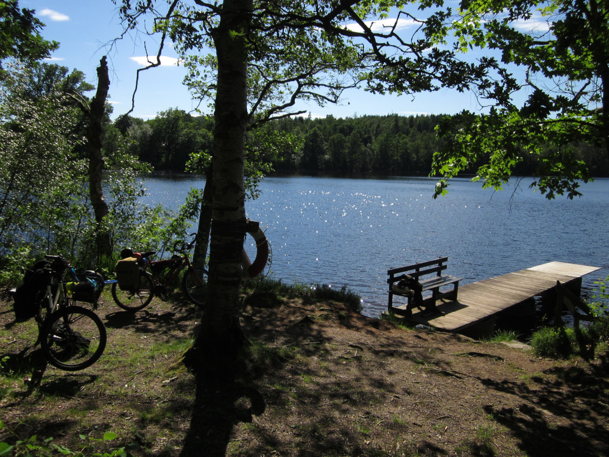

<iframe width="100%" height="500px" frameborder="0" allowfullscreen allow="geolocation" src="//umap.openstreetmap.fr/en/map/jobbretreatet-i-kinna_1080876?scaleControl=false&miniMap=false&scrollWheelZoom=false&zoomControl=true&editMode=disabled&moreControl=true&searchControl=null&tilelayersControl=null&embedControl=null&datalayersControl=true&onLoadPanel=none&captionBar=false&captionMenus=true"></iframe>
<a href="//umap.openstreetmap.fr/en/map/jobbretreatet-i-kinna_1080876?scaleControl=false&miniMap=false&scrollWheelZoom=true&zoomControl=true&editMode=disabled&moreControl=true&searchControl=null&tilelayersControl=null&embedControl=null&datalayersControl=true&onLoadPanel=none&captionBar=false&captionMenus=true">See full screen</a>

| datum | sträcka | cykelvänlighet |
| --- | --- | --- |
| 2-4 juni 2024 (3 dagar) | 45 + 24 + 67 = 136 km | lagom: lugna landsvägar men få cykelbanor, relativt många berg |

Varje sommar åker min forskningsgrupp, [Språkbanken Text](https://spraakbanken.gu.se/), på en retreat någonstans i närheten, och varje år försöker jag att cykla istället för att åka buss med de flesta andra.
År 2023 ledde denna strategi till ett av mina första längre cykeläventyr till Marstrand, en väldigt vacker ö i Kungälvs kommun. 

I år föll valet på __Två skyttlar__, nära Kinna, och jag hade för första gången en _compagno di avventure_[1^], Herbert (riktigt praktiskt när en av dina bästa vänner också är en kollega).
Eftersom väderprognosen var bra (förutom ett kort men kraftigt skyfall precis när vi lämnade Göteborg) bestämde vi oss för att tälta i närheten av slutdestinationen natten innan och på så sätt testa lite bikepacking. 
Vi hittade ett jättebra tältställe vid __Härsjön__ och hann till och med med ett nattdopp.

Morgonen efter cyklade vi till Kinna, där vi hade ett lunch-to-lunch-möte (ett kort blogginlägg om själva retreaten, skrivet av vår kollega Staffan, finns [här](https://spraakbanken.gu.se/blogg/20240605-sprakbanken-text-pa-retreat)).

På väg tillbaka pausade vi för att bada i en annan sjö, som fick smeknamnet "Därsjön" men heter sannolikt __Gingsjön__, baserat på vad jag kan rekonstruera 6 månader senare.

[1^]: Medäventyrare? Resekamrat? Nåt sånt.