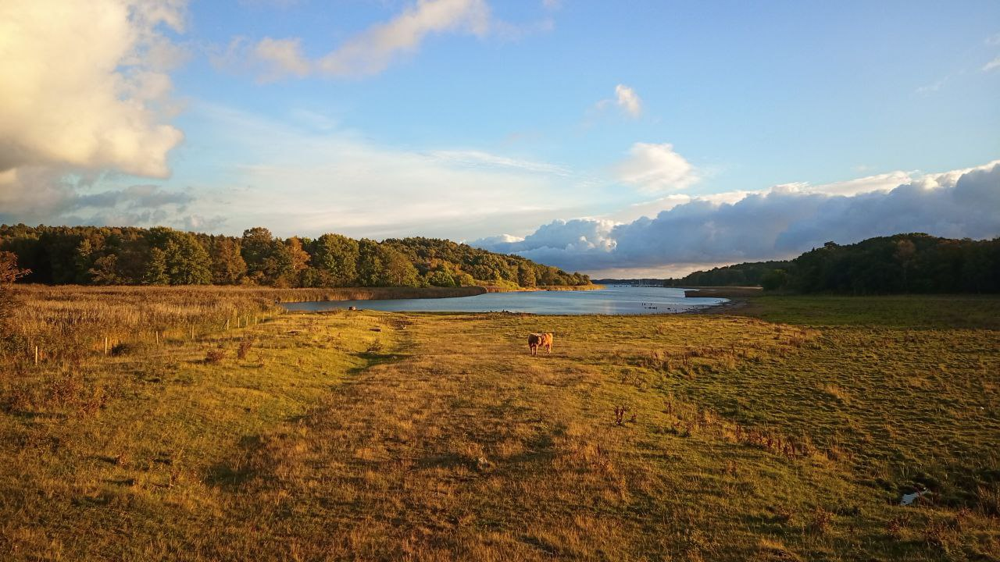

<iframe width="100%" height="500px" frameborder="0" allowfullscreen allow="geolocation" src="//umap.openstreetmap.fr/en/map/valens-naturreservat_1155713?scaleControl=false&miniMap=false&scrollWheelZoom=false&zoomControl=true&editMode=disabled&moreControl=true&searchControl=null&tilelayersControl=null&embedControl=null&datalayersControl=true&onLoadPanel=none&captionBar=false&captionMenus=true"></iframe>
<a href="//umap.openstreetmap.fr/en/map/valens-naturreservat_1155713?scaleControl=false&miniMap=false&scrollWheelZoom=true&zoomControl=true&editMode=disabled&moreControl=true&searchControl=null&tilelayersControl=null&embedControl=null&datalayersControl=true&onLoadPanel=none&captionBar=false&captionMenus=true">See full screen</a>

| datum | sträcka | cykelvänlighet |
| --- | --- | --- |
| 9 juni 2024 | 35 km | toppen |

Välen är ett trevligt och havsnära naturområde, men om man cyklar söderut från Göteborg kan man lika gärna fortsätta till [Amundön](https://harisont.github.io/cykelturism/amundon.html) och få ännu finare utsikt, om det är landskapet man är intresserad av. 
Grejen med naturreservatet i Välen är att det varje år kommer höglandsboskap på besök under några månader. 
Jag upptäckte det helt slumpmässigt under en spårvagnsutflykt i Oktober 2022 (och då tog jag bilden här nere) och bestämde komma tillbaka med Cornelia.

