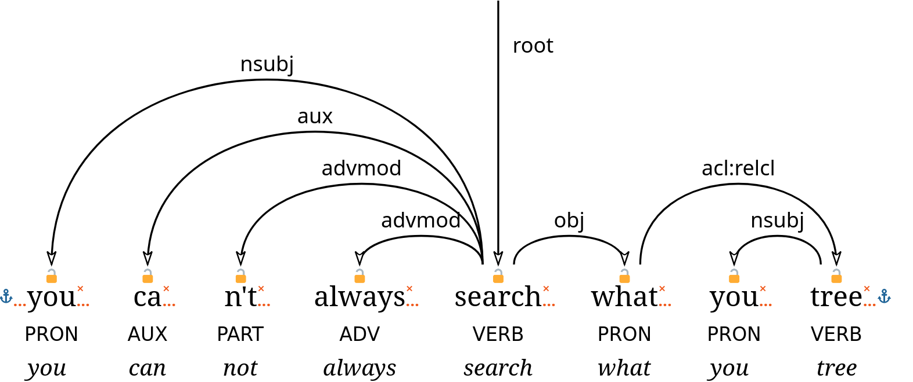
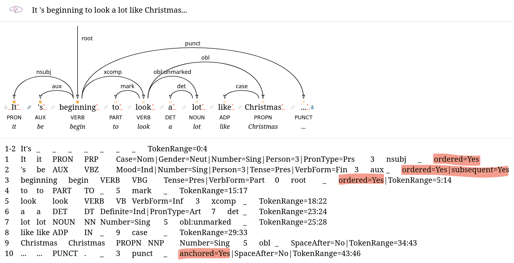

The [December Adventure](https://eli.li/december-adventure) is a chill alternative to the [Advent of Code](https://adventofcode.com/), which is exactly what I need in December: the darkness of this month prompts me to spend even more time on my computer, and my goal is to spend at least some of that time every day doing something I'm excited about. 
Doesn’t even really have to be code, as the organizer says. 

Adventure log:

- [Day 1: plans](#day-1-plans)
- [Day 2: WYTIWYS? WTH?!](#day-2-wytiwys-wth)
- [Day 3: LaTeX macros](#day-3-latex-macros)
- [Day 4: seriously, WTH?](#day-4-seriously-wth)
- [Day 5: add/remove node complete and new website section](#day-5-addremove-node-complete-and-new-website-section)
- [Day 6: chores and literature](#day-6-chores-and-literature)
- [Day 7: more literature](#day-7-more-literature)
- [Day 8: What You See Is What You Wish You Could Get](#day-8-what-you-see-is-what-you-wish-you-could-get)
- [Day 9: music](#day-9-music)
- [Day 10: work, after-work and after-after-work work](#day-10-work-after-work-and-after-after-work-work)
- [Day 11: small website updates](#day-11-small-website-updates)
- [Day 12: hobby as work, work as hobby](#day-12-hobby-as-work-work-as-hobby)
- [Day 13: hmm...](#day-13-hmm)
- [Day 14: Raspberry fields forever](#day-14-raspberry-fields-forever)
- [Day 15: tired enough to look up games](#day-15-tired-enough-to-look-up-games)
- [Day 16: round-robining](#day-16-round-robining)
- [Day 17: slow, almost still](#day-17-slow-almost-still)
- [Day 18: we don't need no Code extension](#day-18-we-dont-need-no-code-extension)
- [Day 19: better treview](#day-19-better-treview)
- [Day 20: bikepacking logbook transcript + tripod thing](#day-20-bikepacking-logbook-transcript--tripod-thing)
- [Day 21: more treviewing and transcribing](#day-21-more-treviewing-and-transcribing)
- [Day 22: decorating the xmas deptree](#day-22-decorating-the-xmas-deptree)
- [Day 23: DIY gifts and `.zshrc`](#day-23-diy-gifts-and-zshrc)


## Day 1: plans
Textbook Monday around here, which leaves little room for adventure besides setting up this log.
For the first few days of the month, I'll be focusing on [wytiwys](https://github.com/harisont/wytiwys/), a programming project that is technically work but also very out of the ordinary (as well as of my comfort zone) and therefore kind of fun.
The enjoyment I often find in my job blurs the line between work and play, but I hope to soon make time for my hobby projects too.
I won't necessarily start anything new and big. 
The plan is rather to do some pleasurable software maintenance, add some new features to my everyday tools, write one or two blog posts and perhaps work on some long-term photography projects.

## Day 2: WYTIWYS? WTH?!
So, [wytiwys](https://github.com/harisont/wytiwys/) is a web-based graphical [dependency tree](https://en.wikipedia.org/wiki/Dependency_grammar) editor and a component of a larger project aimed at making it easier to look for syntactic patterns in large text collections (WYTIWYS stands for What You Tree Is What You Search).

When [the Query Master](https://www.gu.se/en/research/he-builds-it-systems-that-support-future-language-research) and I started looking into this, we found that [reactive-dep-tree](https://github.com/kirianguiller/reactive-dep-tree) does 95% of what we need, and it does it quite well, so my task is just to implement a couple extra features and make some minor tweaks.
Yet, working on wytiwys is definitely adventurous: it requires forking two (if not three) different repositories, intervening on sparsely documented code in TypeScript - a programming language I've never learned and have no ambition to learn - and, worse still, _doing frontend_.
Nothing like my usual PhD work.

Contrary to my expectations, I am having a blast.
Sure, progress is slow, but working in TypeScript with little documentation is akin to reading in Danish without a dictionary: I know enough Swedish to figure out what's going on, but deciphering individual constructions takes effort.
Satisfyingly enough, I've managed to guess my way through the code until now.
Today I actively looked up something (~~list~~ [array concatenation](https://harisont.github.io/lists/web-dev.html#array-concatenation)) for the first time, and I think it's wild.

I'm happy to report I'm almost done adding one of the most important missing features, adding and removing nodes, but less so about the current solution for additions.
I'll try to simplify the code tomorrow.

## Day 3: LaTeX macros
Change of plans!
I thought I'd have some time to work on wytiwys in the afternoon after a seminar, but that was 150% longer than I anticipated (which I didn't mind), so no lines of TypeScript were written today.

On the other hand, I _did_ squeeze a moment of productination into this morning's paper writing session and finally reminded myself how LaTeX macros work.
It's so simple I can't believe this is my first one in years:

```latex
\newcommand{\footnoteurl}[2]{
    \footnote{\href{#1}{\nolinkurl{#2}}}
} % usage: \footnoteurl{LONG-URL}{NICE-URL}
```

The macro allows me to create footnotes whose content is a single URL with a short version, rendered in the PDF, that would work if the reader copy-pasted the link in a modern browser (but not necessarily when clicked from a PDF reader) and a "full" version that is used when the reader clicks on the link.
For example, I used it as 

```latex
\footnoteurl{https://universaldependencies.org/sv/index.html}{universaldependencies.org/sv}
```

## Day 4: seriously, WTH?
This was a long, frustrating day with no time for work that doesn't feel like work at work.
Had a short late night wytiwys session where I tried to complete the hacky implementation of the "add node" functionality I was working on the day before yesterday. 
It seemed to work within a few minutes of writing code, so I thought I'd leave perfectionism aside and keep it that way.
Needless to say, I soon found a bug which seems to be an underlying library's fault (more specifically, it seem to be due to JavaScript's utter lack of type safety, but take all of this with a grain of salt - the whole reasoning is the output of a tired brain past midnight).
It might indeed be necessary to fork a third repository for this project, both if I just want to fix the bug and if I decide to implement a cleaner solution, which would require that either way.

## Day 5: add/remove node complete and new website section
News from a late evening at the office: I was right about the cause of the bug, although it was not in the library I thought, but in the code wytiwys inherited from reactive-dep-tree itself.
Apparently, TypeScript is perfectly happy to do string + number without throwing a type error, which leads to token IDs such as 31 ("3" + 1) instead of 4 (3 + 1).
The fix is a single line change:

```typescript
// was: headId = e.detail.dragged;
headId = parseInt(e.detail.dragged, 10);
```

...but come on! 
Not even _Python_ lets you sum numbers and strings and it doesn't have "type" in its name.

Anyway, I played a little bit with the stylesheet etc. and now the thing looks like this:


(I just noticed I forgot to record the text field where I was typing the new values... Whatever, it's late. I should go home)

I also added a [new section](../lists.md) to this website, because apparently after 12 hours at uni I'm too tired to get groceries, make food or go climbing but not for spending time in my text editor (some days are like that). 
I called it `[[[a]]]` because it's a list of lists of lists. 
The contents have been there for a while, but until now they were only accessible to the selected few that knew what the various URLs were.
I would also like to add a list of all of the Straordinarie Scrittrici Svedesi (extraordinary Swedish women writers) I've been reading since starting to learn Swedish.

## Day 6: chores and literature
Today was reserved for all chores I postponed throughout the week and I had plans with a friend for the evening.
But what about the adventure?
I started taking some preliminary notes for the listpost about my favorite Swedish authors I mentioned yesterday.
Coincidentally, a short story written by of them - _Bortbytingen_, by Selma Lagerlöf - is mentioned in a nonfiction book about autistic women I've just finished reading.
I've been wanting to read some Lagerlöf's short stories for some time, so I went to [Litteraturbanken](https://litteraturbanken.se)[^1] with plans to assemble my own ebook (more or less [like I do with blog posts and other web content](https://harisont.github.io/2025/11/30/hmm.html)), but I had forgotten that most short stories are only available as part of the anthologies they were originally part of.
Well, I guess I'll just read more.

__Listening to__: Arja Saijonmaa & Inti-Illimani, _Jag vill tacka livet - 13 sånger av Violeta parra_ - äkta chilefinlandsvenskmusik!

## Day 7: more literature
Today is the quiet before the storm of work and social commitments that will be next week, and some cozy adventuring (as well as some climbing, cooking and a choir concert I'll go to in a bit) is good mental preparation for that.

I spent about _one hour_ trial-and-erroring a single photo of a stack of books I want to use in my upcoming blog post and I'm still unsure whether any of my attempts is good enough.
I guess one of the problems is that I decided to make my own "studio light" with candles, whereas I usually decide if I should take a picture at all based on the goodness of the light life happens to offer me.



I also started writing the actual blog post, which will be in Italian (the target audience is my family, mostly my parents).

__Listening to__: the local vocal ensemble Sot (live xmas concert).

## Day 8: What You See Is What You Wish You Could Get
I spent the evening refactoring some copy-paste code in wytiwys and adding some SVG elements that do absolutely nothing yet.
Their purpose will be to allow specifying constraints on the (relative) positions of tokens in a sentence.
My trees are now _almost_ as cluttered as they will get (I still have to figure out what symbol to use to signal adjacency between words and, more importantly, where to place it):



__Listening to__: Rolling Stones, _You can't always get what you want_.

## Day 9: music
Today was an unusually musical day. 
A large portion of the afternoon was spent preparing for a music quiz some colleagues and I are organizing for an after-work.

The part where I sat in front of my computer and did something exciting was all about organizing and annotating scans of some renaissance music scores to pass them on to a friend who's part of a wonderful vocal ensemble, Sot, that I've had the pleasure to listen to for the first time last weekend. 
"Excited" isn't exactly the right word to describe how it felt to do this, though: the concert reminded me of the joy I used to find in singing in that kind of ensemble, and going through my scores from that time brings back strong memories. 
The whole experience is rather bittersweet.  

Ironically, today is also the first day of my voluntary musical deprivation phase. 
I stopped paying for Spotify (stoppified?) a few weeks ago; now my subscription ended and I don't have a plan about how to listen to music from now on yet.

__Listening to:__ Tritonus Ensemble ([on YouTube](https://www.youtube.com/@tritonus_ensemble/videos), for lack of a better alternative).

## Day 10: work, after-work and after-after-work work
Today went like this:

1. work
2. after-work
3. work.

First thing in the morning tomorrow, my group is having a discussion about the reliance of our work (crucially, the development of an open research infrastructure for linguistic research) on proprietary SaaS. 
I am the proponent and organizer of that discussion.
Preparing for that strikes me as adventurous enough.

## Day 11: small website updates
I had another very long work day (group meeting, supervision meeting, answering a bunch of emails I had neglected, two and a half hours' worth of syntactic annotation).
All I managed to do was to update my nerdy [RAQs about Swedish syntax in the Universal Dependencies framework](../lists/svud-raq.md#vad-adj) (which is kind of a time consuming but fun side effect of the annotation work) and start a music listening diary for this transition phase from Spotify to I don't know yet what.

__Listening to__: 
_Julbarock med Anna Fusek och La Misticanza_ - a lovely English + Italian baroque music concert on Swedish national radio (also [online](https://www.sverigesradio.se/avsnitt/barockmusik-med-anna-fusek-och-la-misticanza--2)).

## Day 12: hobby as work, work as hobby
Got up early to meet one the awesome students I'm supervising and compare our syntactic annotations.
It is the end of a demanding work week (assuming I don't have to work during the weekend), so I opted for only doing fun work tasks for the rest of the day.
I [updated the UD RAQs](../lists/svud-raq.md#the-abcs-of-ud) again and prepared two mini-presentations for the internal end-of-year show-and-tell we're having on Monday. 
One is about wytiwys (work that almost feels like a hobby project), one about [MagiKarp](https://github.com/harisont/magikarp) (hobby project that almost feels like work).
They are both light-hearted and _riddled_ with inside jokes because, especially after yesterday's meeting, I'm tired of taking myself seriously this semester (and if _I_ am tired of myself, imagine my colleagues).

__Listening to__: Ymna women's choir (another live xmas concert).

## Day 13: hmm...
This morning I finished reading issue number 9 of _hmm_, my [DIY digital magazine](https://harisont.github.io/2025/11/30/hmm.html) ("hmm" stands for "harisont's multilingual magazine").
I spent some time going through my highlights and bookmarks from the ebook, which led to some further exploration of the WWW and [a new [a] in the [[[a]]]](../lists/rss.md), posted about the two most interesting reads [on Mastodon](https://mstdn.social/@harisont/115713480985646886) and prepared the next issue.

I also revamped my RetroPie to play some Tetris with a friend and accidentally ended up with a massively improved setup for my Raspberry Pi (which I mostly use as a media player); details and photos tomorrow.

__Listening to__: political news podcasts in various languages - [El Hilo (es)](https://elhilo.audio/), [Limes (it)](https://www.limesonline.com/audio/serie/limes---il-podcast-di-geopolitica-18453170/), [Europapodden (sv)](https://www.sverigesradio.se/europapodden) (all of them have normal RSS-or-similar feeds and can be listened to via brilliant FOSS apps like [AntennaPod](https://f-droid.org/packages/de.danoeh.antennapod/)).
And then 8-bit music. 
Lots of 8-bit music.

## Day 14: Raspberry fields forever
So, as I touched upon yesterday, I have a Raspberry Pi that I occasionally use for watching videos on my projector, playing ~~games~~ Tetris and (even more occasionally) listening to the music I still have in a hard drive from the pre-streaming times.

I don't like video games a lot, but I do enjoy watching movies (as well as other long-form videos) at home.
The reason why I only do that sporadically is that my system is a huge mess of wires and peripherals, so impractical to set up that I have to plan for it in advance and so ugly that I always want to disassemble everything as soon as the movie is over.
As for music, which I listen to on a daily basis, it goes without saying that streaming stuff with Spotify on my phone is orders of magnitude more convenient than maintaining my own music library and dealing with LibreElec/Kodi (the impressive, yet incredibly frustrating software I use on the Pi) to play it. 

Ever since I decided to stoppify (and, in general, to take a step back from music streaming subscriptions at least temporarily), I thought I might give Kodi another chance.
Plus, I recently discovered [PlayOnDlna](https://f-droid.org/en/packages/io.github.scovillo.playondlna/), an awesome Android app to stream YouTube videos to Kodi.
Combined with [LibreTube](https://f-droid.org/en/packages/com.github.libretube/), it convinced me to finally get rid of my Chromecast and use the Raspberry Pi more. 
However, the Mighty Jungle of Cables issue persisted.

Yesterday, I finally realized that, on top of the Raspberry Pi itself, I _also_ have a beautiful, odd, solid wood box my aunt gave me as a birthday present last year.
The reason why the box looks interesting is that it used to contain a field telephone, and the fact that it contained a field telephone means it has an abundance of differently shaped _holes_ in all the right spots... you know where this is going, right?
I call it the Field Raspberry.





The inside is still a mess, but I already love how this thing is turning out.

Today I worked on the software side of things.
Not in the sense of _writing_ any software, but as in configuring LibreElec/Kodi.
I imported my old music library and movies, installed a couple web radio plugins, got the analog audio to work reliably (it was just a matter of uncommenting a couple lines in a config file, but good luck finding the config file) and set everything up so that I can remote control Kodi from my phone (with the [Kore](https://f-droid.org/en/packages/org.xbmc.kore/) app). 
This means that, when the Field Raspberry is not connected to a screen or projector (which is most of the time), I can use my phone to play music.

I will happily do that for the rest of the evening while I read through one of my students' project report draft.

__Listening to__: random stuff from my outdated digital music library.

## Day 15: tired enough to look up games
After a short night's sleep and a long work day, the only thing I could bring myself to do was to tidy up my RetroPie library, deleting a bunch games I hate and adding a few new ones to try out. 
The latter is kind of pointless, because as much as I enjoy testing games every now and then, they never keep me entertained for more than a few hours (with very, very few notable exceptions).
Also, I didn't get the one I was most curious about, Captain Blood, to run. 

## Day 16: round-robining
Spent the morning multitasking (or, to be exact, round-robining) doing loads of laundry and pre-selecting pictures for a photobook I'm putting together as a ~~xmas~~ new year gift for a relative.
I made another one for my parents a few months ago and it took at least a week of work, so being at the selection stage _the day before_ the files have to be ready to ensure the book is printed in time feels a bit stressful.
On the other hand, this book is much simpler: all photos are 4:3 and should appear in chronological order, one per page, so no need to tinker with the layout at all; postprocessing and text will be minimal (most photos are ok straight out of camera, a few need some cropping or similar); not to mention that, unlike last time, I'm using a typesetting software I'm already familiar with and, also importantly, in a language I know.
I will probably do everything else tomorrow, as starting work after lunch usually implies finishing late.

__Listening to__: the wonderful Paolo Poli reading the classic of Italian literature _I promessi sposi_.

## Day 17: slow, almost still
So, I actually finished the photobook already yesterday night (well... technically today, but it still felt like yesterday), which caused me to amply oversleep in the morning.
Despite the late start, it was a rather productive day, enough that I carved about an hour for wytiwys, but with little success.
I'm afraid unless I get a few consecutive hours in a row to work on that, progress will continue to be "slow, almost still" (as a legendary piano teacher used to say when people played too fast).
Luckily, climbing with some friends before dinner almost made most of the frustration dissipate.

## Day 18: we don't need no Code extension
(...nor do we need Visual Studio Code itself, because a truly FLOSS version exists: [Visual Studio Codium](https://vscodium.com/))

Today I had two separate meetings with two different students and a significant portion of _both_ involved someone complaining about the linguistic annotation tool [Arborator](https://arborator.grew.fr).
Now, I don't think Arborator is bad software. 
In fact, I think it's by far the best of its kind and I like its drag-and-drop interface enough that I'm using it as the starting point for wytiwys.
The problem is, Arborator is research software, and research software (especially if as-a-service) breaks.
I don't blame Arborator's maintainers - we have enough issues of this kind despite having excellent research engineers, so I assume that they are also trying their absolute best.
The more common causes for research software malfunctioning or becoming entirely unavailable are (choose one or several) understaffed IT departments, overworked sysadmins and limited funding for software development, let alone software maintenance.

As I said, I do like Arborator's GUI, especially when it comes to editing dependency edges, but I don't necessarily think it makes me more accurate or efficient (actually, editing certain fields takes too much clicking around for my taste).
The two things that _do_ make a difference in this sense, compared to editing [CoNLL-U](https://universaldependencies.org/format.html) files directly in the text editor, are:

1. seeing dependency trees in their graphical form (the fact that they're interactive is a plus, but a live preview would be more than enough)
2. having the output of the validation checks easily available along with each tree.

None of this requires all of Arborator's infrastructure. 
For quite a while I've been thinking that it'd be nice to have at least some kind of previewing functionality built into my text editor to make it less painful to do annotation work when Arborator is down and, in general, to make it easier to work offline.
It helps that I have already written a [CoNNL-U visualizer](https://github.com/aarneranta/deptreepy/blob/main/visualize_ud.py) as part of another project.

Today I decided it was time to act upon this thought and started going through the [VSCode extensions tutorial](https://code.visualstudio.com/api/get-started/your-first-extension)... but I hated it.
Since my visualizer outputs HTML-embedded SVG, I started considering forking one of the existing HTML visualizers for VSCode and proceeding by clueless minimal edits, just like I'm doing with wytiwys, until I'd get it to work for CoNNL-U files.
But that was not needed! 
In my search for viable starter code, I found the glorious [Document Preview extension](https://github.com/garlicbreadcleric/vscode-document-preview?tab=readme-ov-file) that allows you to preview _anything_ that can be converted into HTML.
So I did 1+1, made minor adaptations to my pre-existing visualization code, and now I have a basic live ~~tree preview~~ treview in Codium:


Code and setup instructions [here](https://github.com/harisont/treview).
Can't wait to do some annotation work tomorrow and improve the output as I go. 
Ah the joy of small programs!

__Listening to__: Pink Floyd, _The wall_.

## Day 19: better treview
Work-from-home day.
Did some annotation work with treview, which is already working great for me, opened an [issue](https://github.com/garlicbreadcleric/vscode-document-preview/issues/2) to see if the creators of the extension it relies on are willing to fix [the only real problem I've encountered so far](https://github.com/harisont/treview?tab=readme-ov-file#known-issues), and added the possibility to display select metadata items.

__Listening to__: [Rachmaninoff's _Vespers_, performed by the National Academic Choir of Ukraine 'Dumka' (conductor: Yevhen Sachuk)](https://youtu.be/eXZZrTRY8vU?si=cwPiKju2ZvbKDjly).

## Day 20: bikepacking logbook transcript + tripod thing
Today I watched [this bikepacking video](https://youtu.be/BwLsGG8Pyls), which rekindled my ambition to write a blog post about last summer's bike trip.[^2]
It'll look similar to my [Kattegattleden post from last year (in Swedish)](https://harisont.github.io/cykelturism/kattegattleden.html), with an interactive map and a few photos, but while last year I used the pictures to remind myself of what happened each day, this time I have an 18-page logbook to start off from.
I'm tempted to just transcribe those notes and publish them with just minor edits (I __love__ reading [Hundred Rabbit](https://100r.co/site/home.html)'s logbook transcripts!), but as I'm flipping through the pages I realize that the amount of code switching in the handwritten text might be too much even for my chaotically multilingual blog.
I'll figure something out. 

I also refined the Field Raspberry a little.
I found some shorter cables to reduce the clutter, reorganized the internal storage space and put together a... platform... thing? for quick projector setup that can sit on top of (or be stored inside) the wooden box. 
It essentially consists of part of an old crappy tripod screwed onto a tiny wooden shelf I found in the box where I keep my "construction material" (aka random items that may or may not eventually be reused).
This will come in handy whenever I feel like my proper photography tripod is overkill.

__Listening to__: George Harrison, _Early takes volume 1_ (on the Field Raspberry).

## Day 21: more treviewing and transcribing
Today I had to finish some syntactic annotation work due tomorrow, but it's Sunday, so I mix business with pleasure and alternate the actual work that I'm paid for with improving the tool I've built for carrying out that work, treview.
It is now possible to preview more stuff, but not everything that is available in the file.
I prioritized things that are actually useful for me to see and things that I will probably never need but don't take too much vertical space.
I don't think I'll implement the remaining visualizations: the source code is available and, I dare say, readable _enough_ that, if someone _really_ wants kilometers of text under each node, they can relatively easily add what's missing.
I also did some basic code cleanup - long lines and inconsistent use of quotes and indentation were bugging me.

I'm really enjoying working both _on_ and _with_ treview: the project is small, fun and actually really useful _right now!_ 
My annotation work has never been more efficient and every time I see room for improvement or notice missing functionalities I can go back to the code and quickly adapt it to my own needs.

__Listening to__: [Studio Ghibli music in the only version I like](https://youtu.be/-LH8_6QjhLw?si=u_OJmlYJfcdTlg9w).

After dinner, I spent an hour transcribing some of the logbook and choosing photos to go with the text.
I'm currently on day 3 of 9.

__Listening to__: the soundtrack of Mother 3, which I'm trying out on the Field Raspberry. 
Kinda cool, but I highly doubt I will ever play it through.

## Day 22: decorating the xmas deptree
Today, I could finally dedicate several hours of my work day to wytiwys.
My brain is a bit fried so please excuse the incomprehensible update.
I swear this is not how I explain things to my students.

Anyway. 
I managed to both:

- add the last few ~~xmas decorations~~ buttons (I mean the chains/links. Centering them between words took me _forever_ because I struggle with spatial reasoning) 
- implement the logic to toggle the various constraints that they represent by clicking on them, updating the SVG itself (opacity of the various icons), as well as the underlying JSON and tabular representation (under the tree in the picture below).



There's still a minor UI bug that is most likely my fault (even if I would love to blame it to the code I inherited) but I feel like I can move to the third and last major issue, which is redoing the UI "around" the tree to enable hiding/showing different features.

In the process, I learned about [lambdas](../lists/web-dev.md#lambdas) and [basic operations on JSON objects](../lists/web-dev.md#json-object-operations).

Listening to: [Naxatras](https://www.naxatras.com/).

## Day 23: DIY gifts and `.zshrc`
The photobook came and it's beyond expectations!
Aside a single very obvious error and a couple typesetting choices that are questionable in hindsight, I'm so happy how it turned out and I _almost_ like the company I ordered it from. 
The materials and print quality are good (actually, my photograph have rarely looked so good on paper), the only branding in the final product is a minuscule logo and most importantly, they make their desktop app (which is half impressive half horrendous) available from Linux directly from their homepage (the German version is even on AUR!).
On the other hand, it'd be nice to do everything with FOSS (and as a bonus, more sensible) software next time.
Typesetting a book of this kind from scratch in LaTeX wouldn't be too hard, but I'd have to investigate how to best get the PDF printed.



I'm spending the night DIYing another gift, the only one that actually needs to be ready tomorrow.
Can't give any details because the friend I'll spend xmas with _does_ check this website sometimes.
I'm looking forward to a couple fun days together doing things we enjoy (including our own mini-hackaton!), none of which is particularly xmassy. 
Since I'll have her over for two days in a row, log updates will probably be delayed, but my adventure should continue at least until the 28th, when my actual holidays start.

Because of all the giftmaking _and_ work I didn't write any code today. 
However, inspired by [a conversation on Mastodon](https://mstdn.social/@thgie@post.lurk.org/115769382462098887), I played around with my `.zshrc` (i.e. my shell config file), especially with the aliases.
I'm getting to a point where I have a few useful and/or fun ones:

```shell
alias yogurt="yay" 
# used to be an alias for yaourt, which is impossible to type. Stays for historical reasons

alias grab="history | grep" 
# most used alias ever (I tend to forget it's an alias), even though the name should have been something more archaeological

alias open="xdg-open" 
# because who thought xdg-open was a good name for a command?

alias pling="aplay -q PATH-TO-A-RECORDING-OF-A-PERSON-SAYING-'PLING'" 
# recommended use: COMMAND_THAT_TAKES_FOREVER && pling. The specific sound file is from the lovely videogame Hiddenfolks, where all sound effects are recordings of someone saying the sounds

alias MY_PYTHON_SCRIPT="python PATH_TO_DEVELOPMENT_VERSION_OF_MY_PYTHON_SCRIPT"
# much better than linking the dev version to /urs/bin/whatever

alias fir="git"
# I always type "fir" instead of "git", so I might as well

alias ops="fuck"
alias skit="fuck"
alias nope="fuck"
# various ways to fix less predictable typos, regardless of the language my brain is thinking in (I don't tend to swear in Italian, so ops will have to do)

alias please="sudo"
alias suvvia="sudo"
# alternative ways to do things mere mortals like harisont can't do
```

__Listening to__: random classical music from P2 (a Swedish national radio station, delightfully devoid of any ads whatsoever).

---

[^1]: Litteraturbanken is a Swedish organization that makes Swedish literature in the public domain freely available online and as high-quality ebooks. Their website is one of my absolute favorite things about Sweden. Every country should have a litteraturbank.
[^2]: ...Yes, I know I have  another blog post in the making, but this adventure is supposed to be fun, not necessarily productive.