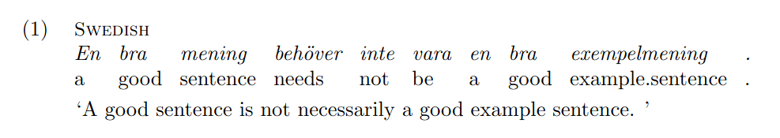

Stuff that make LaTeX an actually pleasurable experience, but that I have to look up every single time:

- [Compilers](#compilers)
- [Macros](#macros)
- [Resizing stuff to text/column width](#resizing-stuff-to-textcolumn-width)
- [Adding a full-page segment to a two-column paper](#adding-a-full-page-segment-to-a-two-column-paper)
- [Adjusting margins](#adjusting-margins)
- [Glossed linguistic examples](#glossed-linguistic-examples)

## Compilers

| if                                        | then     |
| ----------------------------------------- | -------- |
| Greek + Latin characters in the same text | XeLaTeX  |
| Springer Nature template                  | pdfLaTeX |

## Macros
Example macro with two arguments that creates a clean version of an unwieldy URL whilst retaining all the `https://`s and encoded mess in its clickable version:

```latex
\newcommand{\cleanurl}[2]{\href{#1}{\nolinkurl{#2}}}
% usage: \cleanurl{https://www.unwieldy.nope}{unwieldy.nope}
```

## Resizing stuff to text/column width
Essentially

```latex
\resizebox{\textwidth}{!}{whatever}
% replace \textwidth with \columnwidth as needed
% prepend 0.N to \xxxwidth if the content should be resized to a fraction of the given width
```

but for tables, the box should be around the `tabular` and __not__ wrap the entire `table` environment.

## Adding a full-page segment to a two-column paper
```latex
\onecolumn
```

## Adjusting margins
```latex
\usepackage[margin=Xin]{geometry}
```

## Glossed linguistic examples
Add

```latex
\usepackage{covington}
```

and optionally

```latex
\setglossoptions{
    fspreamble=\scshape\small, % style of the pre-gloss text
    fsi=\itshape,              % style of the main text
    fsii=\normalfont}          % style of the gloss
```

(there is also a bunch of other options, described in the ~~awfully long~~ incredibly thorough `covington` package [docs](https://ctan.math.washington.edu/tex-archive/macros/latex/contrib/covington/covington.pdf); these are the ones I most commonly use)

Use as:

```latex
\begin{example}
    \label{utbildning}
    \digloss[preamble=Swedish]
        {En bra mening behöver inte vara en bra exempelmening .}
        {a good sentence needs not be a good example.sentence .}
        {A good sentence is not necessarily a good example sentence. }
\end{example}
```

which will render as
 


`\trigloss`es are also possible.