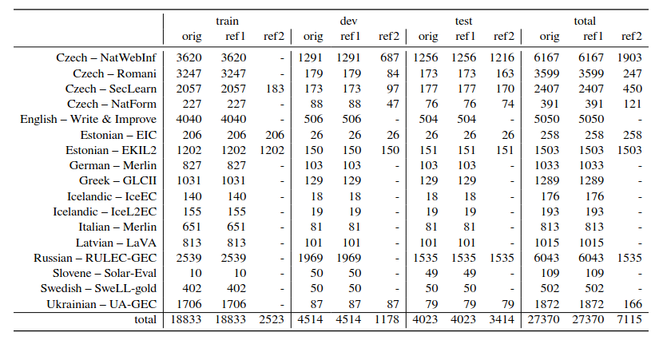

Things that make LaTeX definitely worth it, but that I have to look up every single time:

- [Compilers](#compilers)
- [Macros](#macros)
- [Resizing stuff to text/column width](#resizing-stuff-to-textcolumn-width)
- [Adding a full-page segment to a two-column paper](#adding-a-full-page-segment-to-a-two-column-paper)
- [Adjusting margins](#adjusting-margins)
- [Glossed linguistic examples](#glossed-linguistic-examples)
- [Ge\`ez and Latin script in the same document](#geez-and-latin-script-in-the-same-document)
- [Generating tables with Pandas](#generating-tables-with-pandas)

## Compilers

| if                                    | then     |
| ------------------------------------- | -------- |
| Multiple scripts in the same document | XeLaTeX  |
| Springer Nature template              | pdfLaTeX |

## Macros
Example macro with two arguments that creates a clean version of an unwieldy URL whilst retaining all the `https://`s and encoded mess in its clickable version:

```latex
\newcommand{\cleanurl}[2]{\href{#1}{\nolinkurl{#2}}}
% usage: \cleanurl{https://www.unwieldy.nope}{unwieldy.nope}
```

## Resizing stuff to text/column width
Essentially

```latex
\resizebox{\textwidth}{!}{whatever}
% replace \textwidth with \columnwidth as needed
% prepend 0.N to \xxxwidth if the content should be resized to a fraction of the given width
```

but for tables, the box should be around the `tabular` and __not__ wrap the entire `table` environment.

## Adding a full-page segment to a two-column paper
```latex
\onecolumn
```

## Adjusting margins
```latex
\usepackage[margin=Xin]{geometry}
```

## Glossed linguistic examples
Add

```latex
\usepackage{covington}
```

and optionally

```latex
\setglossoptions{
    fspreamble=\scshape\small, % style of the pre-gloss text
    fsi=\itshape,              % style of the main text
    fsii=\normalfont}          % style of the gloss
```

(there is also a bunch of other options, described in the ~~awfully long~~ incredibly thorough `covington` package [docs](https://ctan.math.washington.edu/tex-archive/macros/latex/contrib/covington/covington.pdf); these are the ones I most commonly use)

Use as:

```latex
\begin{example}
    \label{utbildning}
    \digloss[preamble=Swedish]
        {En bra mening behöver inte vara en bra exempelmening .}
        {a good sentence need.PRES not be a good example.sentence .}
        {A good sentence is not necessarily a good example sentence. }
\end{example}
```

which will render as
 


`\trigloss`es are also possible.

## Ge`ez and Latin script in the same document
```latex
\usepackage{polyglossia}
\usepackage{microtype, newunicodechar}
\usepackage[sf, bf, big]{titlesec}
\defaultfontfeatures{Scale=MatchUppercase}
\setmainfont{Abyssinica SIL}[Scale=1]
\setsansfont{Libertinus Sans}
\setmainlanguage{english}
\setotherlanguage{amharic}
\newunicodechar{፡}{፡\ }
\newunicodechar{።}{\@{።} }
\newunicodechar{፣}{፣ }
\newunicodechar{፤}{፤ }
\newunicodechar{፥}{፥ }
\newunicodechar{፦}{፦ }
\newunicodechar{፧}{\@{፧} }
\newunicodechar{፨}{\@{፨} }
\newunicodechar{፠}{\@{፠} }
\newfontfamily{\amharicfont}{Abyssinica SIL}[
  Script=Ethiopic,
  Ligatures=Common,
  WordSpace = {0.1,30.0,1.0}]
```

## Generating tables with Pandas
Nobody likes LaTeX tables (...right?) and a lot of people use GUI table generators like [this](https://www.tablesgenerator.com/).
A much more powerful option that handles subcolumns and other annoyances flawlessly is to generate tables with Pandas. 
This is especially practical when the data to put in the table comes from a Python script.

**Basic idea for basic (non-nested) tables**: store your data as a `DataFrame` and run `.to_latex()` on it.
A dictionary can be easily converted into a `DataFrame`:

```python
df = pandas.DataFrame(a_dict) # dict -> DataFrame
df.to_latex()                 # DataFrame -> LaTeX string
```

**Advanced idea for advanced (nested) tables**: store your data as a `DataFrame` of `DataFrame`s, do some mystery reindexing and run `.to_latex()` on the resulting data structure. 
Note that:

- a `DataFrame` of `DataFrame`s can be obtained by concatenating a dictionary of `DataFrames`:

    ```python
    df_of_dfs = pandas.concat(dict_of_dfs, axis=1) # I don't remember what axis=1 does
    ```
- mystery reindexing amounts to running `.reindex()`:

    ```python
    df_of_dfs.reindex(rows)
    ```

**Working example that is not at all self-contained and I will generalize as soon as I have time**:

```python
def build_recap_table(specific_tables):
    rows = ["{} -- {}".format(lang.title(), subcorpus) for (lang,subcorpus) in langcorpora] + ["total"]
    cols = SPLITS + ["total"]
    subcols = ["original_essays", "reference_essays_1", "reference_essays_2"]#, "reference_essays_3", "reference_essays_4"]
    nested_data = {}
    for col in cols:
        col_data = {}
        for subcol in subcols:
            subcol_data = {}
            cross_sub_tot = 0
            for (lang, subc) in langcorpora:
                row = "{} -- {}".format(lang.title(), subc)
                if subcol in specific_tables[lang][subc]["texts"]:
                    n = specific_tables[lang][subc]["texts"][subcol][col]
                else:
                   n = 0
                subcol_data[row] = n
                cross_sub_tot += n
            subcol_data["total"] = cross_sub_tot
            col_data[subcol] = subcol_data
        nested_data[col] = pd.DataFrame(col_data)
    nested_df = pd.concat(nested_data, axis=1)
    nested_df.reindex(rows)
    return nested_df


recap_table = build_recap_table(specific_tables)
recap_table.to_latex()
```

This generates a table that looks more or less like this (modulo some text replacements e.g. to shorten the column names):

